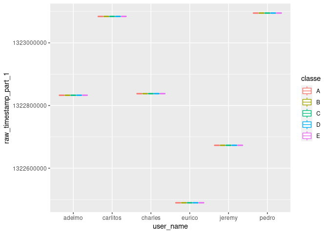
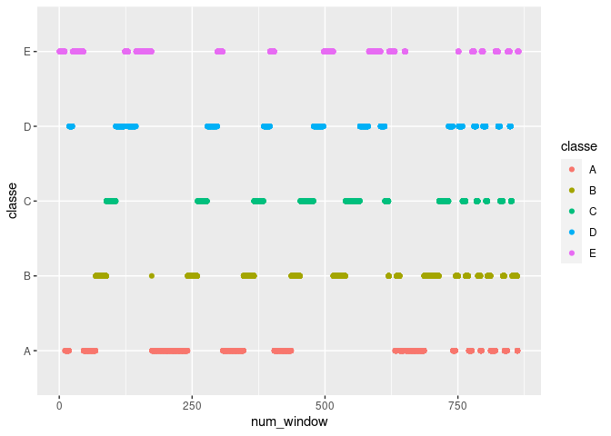

Automated Exercise Assistant
================
Andrew Luyt
2023-06-18

<figure>

<figcaption aria-hidden="true">AI-generated image of a woman exercising
with a smart device</figcaption>
</figure>

# Purpose

To build a machine learning model that can accurately detect if a human
is performing an exercise using the incorrect form. The model will only
use measurements from accelerometers on the body & dumbbell while
performing dumbbell bicep curls.

This project aims to improve upon the results of a 2013 experiment
yielding a model with 78.5% accuracy.

The model should be able to **detect and distinguish between** mistakes
such as incorrect elbow position or only partially lifting the dumbbell.
It should also be, at least theoretically, implementable on a wearable
device such as a smart watch or FitBit.

If a person’s errors in exercise form could be detected automatically
and in real-time, one possible application would be a wearable device
sending an audio notification to tell the user their form is suspect:
e.g. throwing elbows to the front or thrusting their hips forward.

# Summary of Results

Finding that the data were not well-suited to the assumptions of Linear
Discriminant Analysis,
**we were able to build random forest and boosted models with predictive
accuracy of 99.3%.**

# The dataset

19623 observations over 160 variables, mostly numeric features extracted
from accelerometer data streams.

The `classe` variable is our target. It holds five classes corresponding
to correct & incorrect form while doing the exercise:

- **A**: correct form
- **B-E**: incorrect form (common mistakes)
  - B: throwing the elbows to the front
  - C: lifting the dumbbell only halfway
  - D: lowering the dumbbell only halfway
  - E: throwing the hips to the front

Variable selection will be an important part of this problem.

These data come from a 2013 experiment, *Qualitative Activity
Recognition of Weight Lifting Exercises* by Velloso, E.; Bulling, A.;
Gellersen, H.; Ugulino, W.; Fuks, H., and was released under a Creative
Commons licence. \[See References for URLs\]

# Benchmarks

The original researchers obtained 78.5% overall accuracy on this
dataset, with class-specific accuracies between 74% and 86%.

<figure>

<figcaption aria-hidden="true">Figure by Velloso, E.; Bulling, A.;
Gellersen, H.; Ugulino, W.; Fuks, H.</figcaption>
</figure>

# Cleaning and preprocessing

Using `skimr::skim()` we find that 100 variables have over 97% of their
data missing. We’ll simply remove these variables. This greatly
simplifies the problem of variable selection as we now only have 59
predictors available.

`classe` needs to be converted to factors.  
`cvtd_timestamp` is the time the user performed the exercise *during the
original experiment* and will have no bearing on *future* prediction so
it will be removed. `user_name` will be removed as well as we can’t
expect it to be available in the future.

`raw_timestamp_part_1` is *suspicious.* In the plot below we can
distinguish the blocks of time where each `classe` was performed by each
subject. This appears to be due simply to the way the original
experiment was conducted: each subject was asked to perform exercises
with a given form one after another, and these times simply reflect that
sequence. When an algorithm is applied to *future* data (for example a
person doing their workout tomorrow) these time patterns will be
completely different, rendering this feature useless. We will remove
this variable along with `raw_timestamp_part_2`, and `new_window` for
similar reasons.

<!-- -->

`num_window` has similar problems. Below, if for example `num_window` is
about 250, the `classe` will be **B**. This variable seems to be a
sequence identifier for blocks of information sequentially extracted
from the accelerometer data stream during feature extraction. There’s no
reason to suspect this pattern would continue in any future data. This
variable will also be removed.

<!-- -->

## Check variables for normality

Some models, like LDA, assume normal distributions of variables - how
good of an assumption would this be? Using a Shapiro Test, we find that
no variable is drawn from a normal distribution.

## Check for near-zero-variance predictors

After removing variables full of NAs, `caret::nearZeroVar()` was used.
All variables have sufficient variance to be useful, in theory.

# Modeling

We’ll explore a Linear Discriminant model first as a baseline and then
two ensemble models generally considered to give excellent performance
on classification problems: boosted trees and random forests.

## Linear Discriminant Model

Earlier we found that the variables are not normally distributed, so we
can’t expect good classification performance from LDA.

`classe` was fit to all variables and the resulting accuracy estimate
via a .632 bootstrap was 70%. The original researchers obtained 78.5%
using a different model, so we will have to improve on this.

    ##   Accuracy Kappa
    ## 1    0.703 0.624

## Stochastic Gradient Boosting

Tree-based ensembles are traditionally strong performers on
classification tasks. Our first ensemble will use gradient boosting via
the `gbm` model.

A tuning grid is used to estimate optimal hyperparameters and
generalization error is estimated with a .632 bootstrap using `caret`.

    ##  Accuracy     Kappa 
    ## 0.9938957 0.9922679

These are superb results compared to our baseline, perhaps too good.
We’ll investigate the possibility of overfitting in the next section.
The parameters of the best model found were as follows:

<table class="table" style="width: auto !important; ">
<thead>
<tr>
<th style="text-align:right;">
n.trees
</th>
<th style="text-align:right;">
interaction.depth
</th>
<th style="text-align:right;">
shrinkage
</th>
<th style="text-align:right;">
n.minobsinnode
</th>
</tr>
</thead>
<tbody>
<tr>
<td style="text-align:right;">
450
</td>
<td style="text-align:right;">
6
</td>
<td style="text-align:right;">
0.1
</td>
<td style="text-align:right;">
10
</td>
</tr>
</tbody>
</table>

### Use an explicit train/validate set

The bootstrap results were suspiciously good and we should suspect
overfitting even though boosted models overfit slowly. Checking our
results by using the best model parameters we found, re-training on a
randomly selected training set and checking accuracy with an independent
validation set we obtain these results:

    ##  Accuracy     Kappa 
    ## 0.9926983 0.9907628

<table class="table" style="width: auto !important; ">
<thead>
<tr>
<th style="text-align:left;">
Prediction
</th>
<th style="text-align:right;">
Sensitivity
</th>
<th style="text-align:right;">
Specificity
</th>
<th style="text-align:right;">
balanced.accuracy
</th>
</tr>
</thead>
<tbody>
<tr>
<td style="text-align:left;">
Class: A
</td>
<td style="text-align:right;">
0.9982079
</td>
<td style="text-align:right;">
0.9966785
</td>
<td style="text-align:right;">
0.9974432
</td>
</tr>
<tr>
<td style="text-align:left;">
Class: B
</td>
<td style="text-align:right;">
0.9842105
</td>
<td style="text-align:right;">
0.9985260
</td>
<td style="text-align:right;">
0.9913683
</td>
</tr>
<tr>
<td style="text-align:left;">
Class: C
</td>
<td style="text-align:right;">
0.9941577
</td>
<td style="text-align:right;">
0.9969148
</td>
<td style="text-align:right;">
0.9955363
</td>
</tr>
<tr>
<td style="text-align:left;">
Class: D
</td>
<td style="text-align:right;">
0.9906736
</td>
<td style="text-align:right;">
0.9987815
</td>
<td style="text-align:right;">
0.9947275
</td>
</tr>
<tr>
<td style="text-align:left;">
Class: E
</td>
<td style="text-align:right;">
0.9935365
</td>
<td style="text-align:right;">
0.9997919
</td>
<td style="text-align:right;">
0.9966642
</td>
</tr>
</tbody>
</table>

The test performance, 99.27%, is very close to the .632 bootstrap
estimate. We can conclude that the model is finding a true predictive
structure in the data.

Let’s also examine the top six most important variables for the boosted
model:

<table class="table" style="width: auto !important; ">
<thead>
<tr>
<th style="text-align:left;">
</th>
<th style="text-align:right;">
Overall
</th>
</tr>
</thead>
<tbody>
<tr>
<td style="text-align:left;">
roll_belt
</td>
<td style="text-align:right;">
3117.3068
</td>
</tr>
<tr>
<td style="text-align:left;">
pitch_forearm
</td>
<td style="text-align:right;">
1727.4100
</td>
</tr>
<tr>
<td style="text-align:left;">
yaw_belt
</td>
<td style="text-align:right;">
1680.7166
</td>
</tr>
<tr>
<td style="text-align:left;">
magnet_dumbbell_z
</td>
<td style="text-align:right;">
1313.3487
</td>
</tr>
<tr>
<td style="text-align:left;">
magnet_dumbbell_y
</td>
<td style="text-align:right;">
1075.1768
</td>
</tr>
<tr>
<td style="text-align:left;">
pitch_belt
</td>
<td style="text-align:right;">
973.0235
</td>
</tr>
</tbody>
</table>

## Random Forest

The first step is to obtain a good estimate for `mtry`, the number of
variables to consider at each split of a tree. This is the only tuning
parameter we’ll consider, and we’ll use specialized method
`randomForest::tuneRF` to get a good estimate.

    ## 
    ## Call:
    ##  randomForest(x = x, y = y, mtry = res[which.min(res[, 2]), 1]) 
    ##                Type of random forest: classification
    ##                      Number of trees: 500
    ## No. of variables tried at each split: 10
    ## 
    ##         OOB estimate of  error rate: 0.57%
    ## Confusion matrix:
    ##      A    B    C    D    E class.error
    ## A 3901    4    0    0    1 0.001280082
    ## B   15 2634    8    0    0 0.008656379
    ## C    0   10 2380    5    0 0.006263048
    ## D    0    0   22 2226    3 0.011106175
    ## E    0    0    3    7 2514 0.003961965

Results suggest the optimal value for `mtry` is around 10. Literature
suggests a value for `mtry` around
$\sqrt{\text{number of features}} = \sqrt{55} \approx 7$ which is close.
We’ll use 10 in our model. Fitting a model with `mtry=10` on the same
training set we used with the boosting method, we get these results:

    ##  Accuracy     Kappa 
    ## 0.9930379 0.9911930

<table class="table" style="width: auto !important; ">
<thead>
<tr>
<th style="text-align:left;">
Prediction
</th>
<th style="text-align:right;">
Sensitivity
</th>
<th style="text-align:right;">
Specificity
</th>
<th style="text-align:right;">
balanced.accuracy
</th>
</tr>
</thead>
<tbody>
<tr>
<td style="text-align:left;">
Class: A
</td>
<td style="text-align:right;">
0.9982079
</td>
<td style="text-align:right;">
0.9976275
</td>
<td style="text-align:right;">
0.9979177
</td>
</tr>
<tr>
<td style="text-align:left;">
Class: B
</td>
<td style="text-align:right;">
0.9877193
</td>
<td style="text-align:right;">
0.9983154
</td>
<td style="text-align:right;">
0.9930174
</td>
</tr>
<tr>
<td style="text-align:left;">
Class: C
</td>
<td style="text-align:right;">
0.9941577
</td>
<td style="text-align:right;">
0.9965035
</td>
<td style="text-align:right;">
0.9953306
</td>
</tr>
<tr>
<td style="text-align:left;">
Class: D
</td>
<td style="text-align:right;">
0.9875648
</td>
<td style="text-align:right;">
0.9991877
</td>
<td style="text-align:right;">
0.9933762
</td>
</tr>
<tr>
<td style="text-align:left;">
Class: E
</td>
<td style="text-align:right;">
0.9944598
</td>
<td style="text-align:right;">
0.9995839
</td>
<td style="text-align:right;">
0.9970218
</td>
</tr>
</tbody>
</table>

The random forest obtains 99.3% accuracy on the validation set, compared
to 99.26% for the boosted model. Their class-specific sensitivity,
specificity, etc are also near-equal. The models are essentially
equivalent in their predictive ability, though the random forest was
much faster to train.

Using the generic `importance` function to list variable importance, the
top six variables for the random forest are the same the boosted model,
suggesting both models are finding similar structures in the data, which
increases our confidence in their correctness.

<table class="table" style="width: auto !important; ">
<thead>
<tr>
<th style="text-align:left;">
variable
</th>
<th style="text-align:right;">
MeanDecreaseGini
</th>
</tr>
</thead>
<tbody>
<tr>
<td style="text-align:left;">
roll_belt
</td>
<td style="text-align:right;">
1008.7102
</td>
</tr>
<tr>
<td style="text-align:left;">
yaw_belt
</td>
<td style="text-align:right;">
658.8992
</td>
</tr>
<tr>
<td style="text-align:left;">
pitch_forearm
</td>
<td style="text-align:right;">
629.6978
</td>
</tr>
<tr>
<td style="text-align:left;">
magnet_dumbbell_z
</td>
<td style="text-align:right;">
573.8069
</td>
</tr>
<tr>
<td style="text-align:left;">
pitch_belt
</td>
<td style="text-align:right;">
520.7653
</td>
</tr>
<tr>
<td style="text-align:left;">
magnet_dumbbell_y
</td>
<td style="text-align:right;">
508.8364
</td>
</tr>
</tbody>
</table>

# Predictions

A test dataset of 20 observations has been provided. We’ll predict using
our boosted and random forest models and compare them to each other.

``` r
pred.gbm.tt <- predict(fit.gbm.tt, df.test)
pred.rf <- predict(fit.rf, df.test)
table(pred.gbm.tt == pred.rf)
```

    ## 
    ## TRUE 
    ##   20

Both models predict the same values for the test set.

# Conclusions

After reducing the number of variables from 160 to 52, we were able to
build both random forest and boosted models with an accuracy of 99.3%,
equivalent to be one false detection in 143 repetitions of a bicep curl.
It seems likely that a combination of smart devices and machine learning
are genuinely able to detect correct vs incorrect exercise form.

To create a real-world product there would be much more work to do,
starting with creating a much larger dataset including all the other
types of exercise the smart device would support - this dataset only
contains observations of one exercise. Other complications such as
expert consultation with exercise physiologists and liability issues
would have to be taken into account, so this is where I will end this
project.

# References

Original Dataset:

Velloso, E.; Bulling, A.; Gellersen, H.; Ugulino, W.; Fuks, [H.
Qualitative Activity Recognition of Weight Lifting
Exercises.](https://www.researchgate.net/publication/266653495_Qualitative_activity_recognition_of_weight_lifting_exercises)
Proceedings of 4th International Conference in Cooperation with SIGCHI
(Augmented Human ’13) . Stuttgart, Germany: ACM SIGCHI, 2013.

Obtained from
<https://web.archive.org/web/20150207080848/http://groupware.les.inf.puc-rio.br/har>
