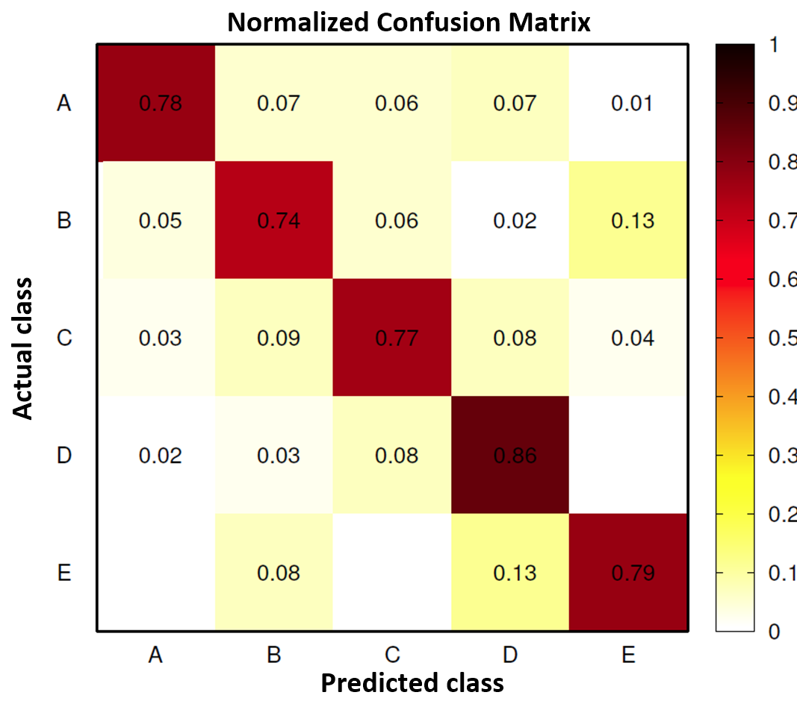

Project: Weightlifting Dataset Prediction
================
Andrew Luyt
2023-06-17

<figure>

<figcaption aria-hidden="true">AI-generated image of a woman exercising
with a smart device</figcaption>
</figure>

# Purpose

To build a machine learning model that can accurately detect if a human
is performing an exercise using the incorrect form. The model will only
use measurements from accelerometers on the body & dumbbell while
performing dumbbell bicep curls.

The model should be able to **detect and distinguish** between mistakes
such as incorrect elbow position or only partially lifting the dumbbell.

The model should be, at least theoretically, implementable on a wearable
device such as a smart watch or FitBit.

This project aims to improve upon the results of a 2013 experiment
yielding a model with 78.5% accuracy.

# Summary of Results

Using linear discriminant analysis (LDA) we created a model with
predictive accuracy of 73%. This did not match the original researchers’
benchmark of 78.5%.

Finding that the data were not well-suited to the assumptions of LDA
**we were able to build a random forest model with predictive accuracy
of 99.6%, and a boosted tree model with an accuracy of 99.5%.**

# The dataset

19623 observations over 160 variables, mostly features extracted from
accelerometer data streams.

The `classe` variable is our target. It holds five classes corresponding
to correct & incorrect form while doing the exercise:

- **A**: correct form
- **B-E**: incorrect form (common mistakes)
  - B: throwing the elbows to the front
  - C: lifting the dumbbell only halfway
  - D: lowering the dumbbell only halfway
  - E: throwing the hips to the front

Variable selection will be an important part of this problem.

If the classes could be distinguished automatically and in real-time,
one possible application would be a wearable device letting off a
notification/alarm to tell the user their form is suspect: e.g. throwing
elbows to the front or thrusting their hips forward.

These data come from a 2013 experiment, *Qualitative Activity
Recognition of Weight Lifting Exercises* by Velloso, E.; Bulling, A.;
Gellersen, H.; Ugulino, W.; Fuks, H., and was released under a Creative
Commons licence. \[See References for URLs\]

# Benchmarks

The original researchers obtained 78.5% overall accuracy on this
dataset, with class-specific accuracies between 74% and 86%.

<figure>

<figcaption aria-hidden="true">Figure by Velloso, E.; Bulling, A.;
Gellersen, H.; Ugulino, W.; Fuks, H.</figcaption>
</figure>

# Cleaning and preprocessing

Using `skimr::skim()` we find that 100 variables have over 97% of their
data missing. We’ll simply remove these variables. *This greatly
simplifies the problem of variable selection* as we now only have 59
predictors available.

`user_name`, `new_window` and `classe` need to be converted to
factors.  
`cvtd_timestamp` is the time the user performed the exercise *during the
original experiment* and will have no bearing on *future* prediction so
it will be removed.

`raw_timestamp_part_1` is *suspicious.* In the plot below we can
distinguish the blocks of time where each `classe` was performed by each
subject. This appears to be due simply to the way the original
experiment was conducted: each subject was asked to perform exercises
with a given form one after another, and these times simply reflect that
sequence. The issue is that they show a *very strong* predictive pattern
in the training data. When an algorithm is applied to *future* data (for
example a person in 2022 doing their normal workout in a gym) these time
patterns may be completely different. We will remove this variable along
with `raw_timestamp_part_2`.

<!-- -->

`num_window` has similar problems. Below, if for example `num_window` is
about 250, the `classe` will be **B**. This variable seems to be a
sequence identifier for blocks of information sequentially extracted
from the accelerometer data stream during feature extraction. There’s no
reason to suspect this pattern would continue in any future data. This
variable will also be removed.

<!-- -->

## Check variables for normality

Some models, like LDA, assume normal distributions of variables - how
good of an assumption would this be? Using a Shapiro Test, we find that
no variable is drawn from a normal distribution.

## Check for near-zero-variance predictors

After removing variables full of NAs, `caret::nearZeroVar()` was used.
All variables have sufficient variance to be useful, in theory.

# Modeling

We’ll explore an Linear Discriminant model first as a baseline and then
two ensemble models generally considered to give excellent performance
on classification problems: boosted trees and random forests.

## Linear Discriminant Model

We found that the variables are not normally distributed, so we can’t
expect good classification performance.

`classe` was fit to all variables and the resulting accuracy estimate
via a .632 bootstrap was 73%. N.B. the original researchers obtained
results about five percentage points higher.

    ##   Accuracy Kappa
    ## 1    0.733 0.662

## Stochastic Gradient Boosting

We’ll use the `gbm` model. A tuning grid is used to estimate optimal
hyperparameters and generalization error is estimated with a .632
bootstrap using `caret`.

    ##  Accuracy     Kappa 
    ## 0.9938498 0.9922100

These are superb results compared to our baseline, perhaps too good.
We’ll investigate the possibility of overfitting in the next section.
The parameters of the best model found were as follows:

<table class="table" style="width: auto !important; ">
<thead>
<tr>
<th style="text-align:right;">
n.trees
</th>
<th style="text-align:right;">
interaction.depth
</th>
<th style="text-align:right;">
shrinkage
</th>
<th style="text-align:right;">
n.minobsinnode
</th>
</tr>
</thead>
<tbody>
<tr>
<td style="text-align:right;">
450
</td>
<td style="text-align:right;">
6
</td>
<td style="text-align:right;">
0.1
</td>
<td style="text-align:right;">
10
</td>
</tr>
</tbody>
</table>

### Use an explicit train/validate set

The bootstrap results were suspiciously good and we should suspect
overfitting even though boosted models overfit slowly. Checking our
results by using the best model parameters we found, re-training on a
randomly selected training set and checking accuracy with an independent
validation set we obtain these results:

    ##  Accuracy     Kappa 
    ## 0.9954152 0.9942008

The test error is very close to the .632 bootstrap estimate. We can
conclude that the model is finding a true predictive structure in the
data.

Let’s also examine the top six most important variables for the boosted
model:

<table class="table" style="width: auto !important; ">
<thead>
<tr>
<th style="text-align:left;">
</th>
<th style="text-align:right;">
Overall
</th>
</tr>
</thead>
<tbody>
<tr>
<td style="text-align:left;">
roll_belt
</td>
<td style="text-align:right;">
3029.9119
</td>
</tr>
<tr>
<td style="text-align:left;">
yaw_belt
</td>
<td style="text-align:right;">
1729.6019
</td>
</tr>
<tr>
<td style="text-align:left;">
pitch_forearm
</td>
<td style="text-align:right;">
1624.3076
</td>
</tr>
<tr>
<td style="text-align:left;">
magnet_dumbbell_z
</td>
<td style="text-align:right;">
1355.1941
</td>
</tr>
<tr>
<td style="text-align:left;">
magnet_dumbbell_y
</td>
<td style="text-align:right;">
1132.4021
</td>
</tr>
<tr>
<td style="text-align:left;">
pitch_belt
</td>
<td style="text-align:right;">
988.0864
</td>
</tr>
</tbody>
</table>

## Random Forest

The first step is to obtain a good estimate for `mtry`, the number of
variables to consider at each split of a tree. This is the only tuning
parameter we’ll consider, and we’ll use specialized method
`randomForest::tuneRF` to get a good estimate.

    ## 
    ## Call:
    ##  randomForest(x = x, y = y, mtry = res[which.min(res[, 2]), 1]) 
    ##                Type of random forest: classification
    ##                      Number of trees: 500
    ## No. of variables tried at each split: 10
    ## 
    ##         OOB estimate of  error rate: 0.57%
    ## Confusion matrix:
    ##      A    B    C    D    E class.error
    ## A 3901    4    0    0    1 0.001280082
    ## B   15 2634    8    0    0 0.008656379
    ## C    0   10 2380    5    0 0.006263048
    ## D    0    0   22 2226    3 0.011106175
    ## E    0    0    3    7 2514 0.003961965

Results suggest the optimal value for `mtry` is around 10. Literature
suggests a value for `mtry` around
$\sqrt{\text{number of features}} = \sqrt{55} \approx 7$ which is close.
We’ll use 10 in our model. Fitting a model with `mtry=10` on the same
training set we used with the boosting method, we get these results:

    ##  Accuracy     Kappa 
    ## 0.9955850 0.9944149

The random forest obtains 99.6% accuracy on the validation set, compared
to 99.5% for the boosted model. The models are nearly equivalent in
their predictive ability, though the random forest was much faster to
train.

Using the generic `importance` function to list variable importance, the
top six variables for the random forest are identical to the boosted
model, suggesting both models are finding similar structures in the
data, which should increase our confidence in their correctness.

<table class="table" style="width: auto !important; ">
<thead>
<tr>
<th style="text-align:left;">
variable
</th>
<th style="text-align:right;">
MeanDecreaseGini
</th>
</tr>
</thead>
<tbody>
<tr>
<td style="text-align:left;">
roll_belt
</td>
<td style="text-align:right;">
944.7879
</td>
</tr>
<tr>
<td style="text-align:left;">
yaw_belt
</td>
<td style="text-align:right;">
659.9613
</td>
</tr>
<tr>
<td style="text-align:left;">
pitch_forearm
</td>
<td style="text-align:right;">
593.0021
</td>
</tr>
<tr>
<td style="text-align:left;">
magnet_dumbbell_z
</td>
<td style="text-align:right;">
542.0314
</td>
</tr>
<tr>
<td style="text-align:left;">
pitch_belt
</td>
<td style="text-align:right;">
513.0512
</td>
</tr>
<tr>
<td style="text-align:left;">
magnet_dumbbell_y
</td>
<td style="text-align:right;">
489.4155
</td>
</tr>
</tbody>
</table>

# Predictions

A test dataset of 20 observations has been provided. We’ll predict using
our boosted and random forest models and compare them to each other.

``` r
pred.gbm.tt <- predict(fit.gbm.tt, df.test)
pred.rf <- predict(fit.rf, df.test)
table(pred.gbm.tt == pred.rf)
```

    ## 
    ## TRUE 
    ##   20

Both models predict the same values for the test set.

# Conclusions

After reducing the number of variables from 160 to 54, we were able to
build a random forest model with predictive accuracy of 99.6%, and a
boosted tree model with accuracy of 99.5%, both estimates coming from an
independent test set.

# References

Original Dataset:

Velloso, E.; Bulling, A.; Gellersen, H.; Ugulino, W.; Fuks, [H.
Qualitative Activity Recognition of Weight Lifting
Exercises.](https://www.researchgate.net/publication/266653495_Qualitative_activity_recognition_of_weight_lifting_exercises)
Proceedings of 4th International Conference in Cooperation with SIGCHI
(Augmented Human ’13) . Stuttgart, Germany: ACM SIGCHI, 2013.

Obtained from
<https://web.archive.org/web/20150207080848/http://groupware.les.inf.puc-rio.br/har>
